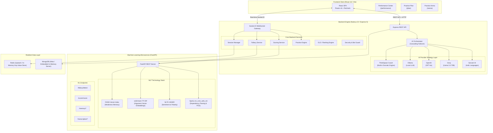
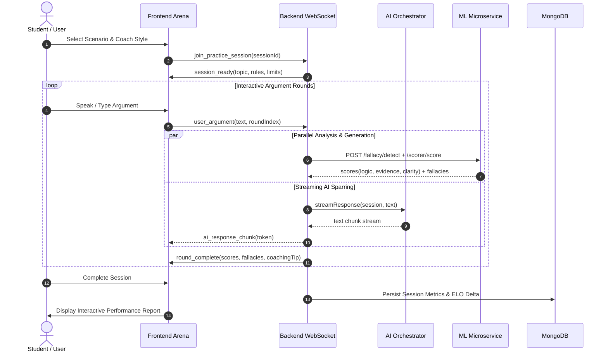
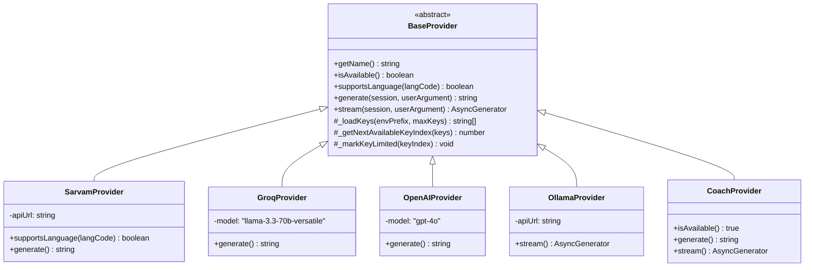
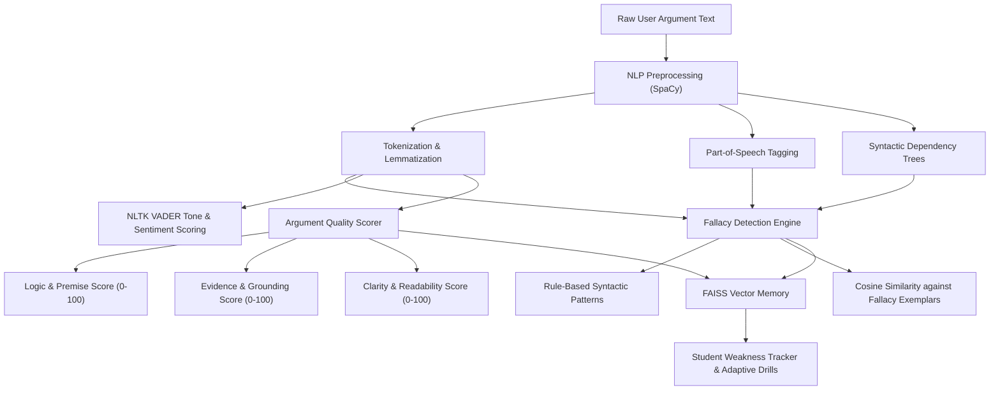

# ThinkSpace — System Architecture & Technical Specifications

## 1. System Overview

**ThinkSpace** is an interactive, microservices-based communication and critical thinking platform engineered around the core pedagogical cycle:
$$\text{PRACTICE} \longrightarrow \text{ANALYSIS} \longrightarrow \text{FEEDBACK} \longrightarrow \text{IMPROVEMENT}$$

The system comprises three primary decoupled layers:
1. **Frontend Presentation Layer**: React 18 single-page application built with Vite, featuring real-time WebSocket communication, audio visualization, Recharts analytics, and responsive design systems.
2. **Backend Application Layer**: Node.js and Express 5 REST & Socket.IO server managing sessions, auth, ELO progression, AI orchestration, and database operations.
3. **Machine Learning Microservice**: Python FastAPI service providing multi-layer logical fallacy detection, argument scoring, vector memory, and speech transcription.

---

## 2. Pedagogical Practice Flow

The real-time communication practice session executes through a deterministic, phase-based state machine:

---

## 3. AI Orchestration & Failover Architecture

ThinkSpace utilizes the **Strategy Pattern** to ensure provider agnosticism. All providers implement the abstract `BaseProvider` contract:

### Failover Cascade Matrix
- **Indian Languages (te, hi, ta, kn, ml, mr, bn, gu, pa, ur)**:
  `Sarvam AI` $\longrightarrow$ `Groq` $\longrightarrow$ `OpenAI` $\longrightarrow$ `Ollama` $\longrightarrow$ **`ThinkSpace Coach`**
- **English & International Languages**:
  `Groq` $\longrightarrow$ `OpenAI` $\longrightarrow$ `Ollama` $\longrightarrow$ **`ThinkSpace Coach`**

> **Zero-Failure Guarantee**: Because `CoachProvider` executes locally within the Node.js runtime and requires zero external credentials or daemon processes, practice sessions will never crash due to network partitions, quota limits, or missing API keys.

---

## 4. Machine Learning & NLP Evaluation Pipeline

The ML microservice evaluates arguments across multiple NLP dimensions:

1. **Syntactic & Dependency Analysis (SpaCy)**: Checks sentence complexity, clause subordination, and grammatical relationships.
2. **Multi-Class Fallacy Classifier**:
   - *Ad Hominem*: Identifies attacks on character rather than the proposition.
   - *Strawman*: Compares distortion against context embeddings.
   - *Slippery Slope*: Detects runaway causal chain assertions without intervening evidence.
   - *False Dilemma*: Detects forced binary options ("either X or destruction").
3. **Sentiment & Confidence Modeling (NLTK VADER)**: Ensures argumentative discourse maintains academic composure and objective tone.
4. **Vector Memory (FAISS + TF-IDF)**: Embeds arguments per user ID to track persistent blind spots over multiple practice days.

---

## 5. High-Availability & Resilience Architecture

To guarantee zero setup friction for academic reviewers, evaluation committees, and students:

### 1. In-Memory MongoDB Auto-Provisioning
- Upon startup, `backend/config/database.js` attempts connection to `process.env.MONGODB_URI`.
- If no external database is detected, it automatically initializes an in-process `MongoMemoryServer`.
- Pre-seeds 23 curated discussion scenarios spanning 5 academic and civic domains.

### 2. In-Memory Redis Session Fallback
- If Redis is absent or network connectivity drops, `backend/config/redis.js` switches to an in-memory key-value cache.
- Implements TTL expiration, sorted sets (`zadd`, `zrevrange`, `zrevrank`), and hash maps for live leaderboard rankings and session tracking.

### 3. Comprehensive Security Perimeter
- **Helmet.js**: Sets essential HTTP security headers.
- **Bot Guard & Honeypot**: Blocks automated scrapers and bad-faith bots.
- **Strict Rate Limiting**: Protects against brute-force attacks on auth and practice endpoints.
- **Stateless JWT with Bcrypt**: Cryptographically secure token authentication with rotating secrets.
