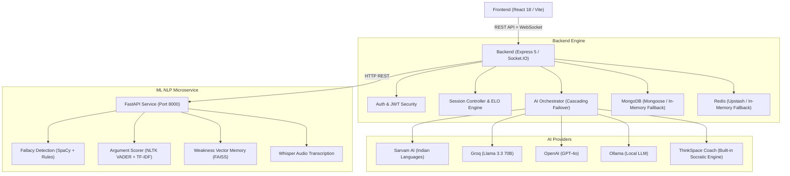

# ThinkSpace — Interactive Communication & Critical Thinking Platform

[](LICENSE)
[](frontend/)
[](backend/)
[](ml/)
[](#testing)

> **ThinkSpace** is an interactive web platform that helps students, educators, and professionals sharpen their reasoning, articulate ideas precisely, and systematically eliminate logical fallacies — built around the core loop:
>
> **`PRACTICE → ANALYSIS → FEEDBACK → IMPROVEMENT`**

---

## Table of Contents

- [Features](#features)
- [Tech Stack](#tech-stack)
- [System Architecture](#system-architecture)
- [Quick Start](#quick-start)
- [Environment Variables](#environment-variables)
- [Testing](#testing)
- [Project Structure](#project-structure)
- [API Reference](#api-reference)
- [License](#license)

---

## Features

### 🎯 Practice Arena
- **23+ curated scenarios** across Technology, Ethics, Society, Education, and Governance — plus custom prompts
- **4 AI coach personas**: Socratic Questioner, Academic Scholar, Balanced Synthesizer, Critical Challenger
- **Multilingual support**: English + Indian regional languages (Telugu, Hindi, Tamil, Kannada, Marathi, and more)
- **Speech-to-Text & Text-to-Speech** via Web Speech API and optional Whisper/ElevenLabs integration

### 📊 AI Analysis & Evaluation Engine
- **Multi-axis scoring** on every response: Reasoning, Communication, Clarity, and Evidence Usage
- **Real-time logical fallacy detection**: Ad Hominem, Strawman, Slippery Slope, False Dilemma, Circular Reasoning, Hasty Generalization, Appeal to Emotion
- **Downloadable session reports**: Standalone HTML transcripts with interactive charts

### 📈 Performance Center
- Historical skill progression tracking across all sessions
- **5-axis competency radar** — Reasoning, Communication, Clarity, Evidence, Fallacy Resistance
- Cognitive bias & fallacy distribution with actionable next-step recommendations

### 📅 Structured Practice Plan
- Configurable **7, 14, or 30-day** guided learning tracks
- Targeted skill objectives with daily drills and persistent milestone tracking

### 🛡️ Zero-Configuration Resilience
- **Auto in-memory MongoDB** — launches an embedded MongoDB + auto-seeds 23 scenarios if no external DB is configured
- **Auto in-memory Redis** — seamless cache fallback if Redis is absent
- **AI provider failover chain**:
  - Indian Languages: `Sarvam AI → Groq → OpenAI → Ollama → ThinkSpace Coach (built-in)`
  - English: `Groq → OpenAI → Ollama → ThinkSpace Coach (built-in)`
  - Sessions **never crash**, even fully offline with no API keys

---

## Tech Stack

| Layer | Technologies |
|:---|:---|
| **Frontend** | React 18, React Router v6, Vite, Recharts, Lucide Icons, Vanilla CSS |
| **Backend** | Node.js 22 LTS, Express 5, Socket.IO, Helmet, express-rate-limit, Nodemailer |
| **Database** | MongoDB (Mongoose) + `MongoMemoryServer` fallback; Redis + in-memory store fallback |
| **ML Service** | Python 3.11+, FastAPI, SpaCy (`en_core_web_sm`), NLTK (VADER), scikit-learn, FAISS |
| **Testing** | Vitest (Frontend), Jest + Supertest (Backend), Pytest (ML) |

---

## System Architecture



For detailed architecture diagrams and technical specifications, see [ARCHITECTURE.md](ARCHITECTURE.md).

---

## Quick Start

### Prerequisites

| Requirement | Version |
|---|---|
| Node.js | v18.0.0 or higher (v20/v22 LTS recommended) |
| Python | v3.9 or higher |
| Git | Any recent version |

> **Zero-config tip**: ThinkSpace works out of the box with no database or API keys. The built-in fallbacks handle everything automatically.

### 1. Clone the Repository

```bash
git clone https://github.com/Srikar-jayanthi/ThinkSpace.git
cd ThinkSpace
```

### 2. Backend Setup

```bash
cd backend
npm install
npm start
```

> ThinkSpace auto-detects if MongoDB is missing, launches an embedded in-memory database, and seeds 23 default practice scenarios.
> Backend API runs at: **`http://localhost:5000`**

### 3. Frontend Setup

Open a **new terminal**:

```bash
cd frontend
npm install
npm run dev
```

> Frontend client runs at: **`http://localhost:5173`**

### 4. ML Microservice Setup *(Optional — for NLP evaluation)*

Open a **new terminal**:

```bash
cd ml
pip install -r requirements.txt
python -m spacy download en_core_web_sm
uvicorn main:app --reload --port 8000
```

> ML service API docs available at: **`http://localhost:8000/docs`**

---

## Environment Variables

Copy the example file and fill in only the values you need. All external services (DB, Redis, AI keys) are **optional** — ThinkSpace runs fully without them.

```bash
cp .env.example .env          # root config reference
cp backend/.env.example backend/.env
cp frontend/.env.example frontend/.env
cp ml/.env.example ml/.env
```

Key variables (all optional — defaults work out of the box):

| Variable | Description | Default |
|---|---|---|
| `MONGODB_URI` | MongoDB connection string | Auto in-memory |
| `REDIS_URL` | Redis connection string | Auto in-memory |
| `GROQ_API_KEY` | Groq LLM key | ThinkSpace Coach fallback |
| `OPENAI_API_KEY` | OpenAI key | ThinkSpace Coach fallback |
| `SARVAM_API_KEY` | Sarvam AI key (Indian languages) | ThinkSpace Coach fallback |
| `JWT_SECRET` | JWT signing secret | Required for production |

See [`.env.example`](.env.example) for the full reference.

---

## Testing

ThinkSpace ships with automated test suites across all three subsystems.

### Backend — Jest + Supertest

```bash
cd backend
npm test
```

> 8 test suites · 61 tests · 100% pass rate

### Frontend — Vitest

```bash
cd frontend
npx vitest run
```

> 8 test suites · 8 tests · 100% pass rate

### ML Service — Pytest

```bash
cd ml
python -m pytest tests
```

> 16 tests · 100% pass rate

### Frontend Production Build

```bash
cd frontend
npm run build
```

> Zero errors · Bundle generated in < 5 seconds

---

## Project Structure

```
ThinkSpace/
├── backend/                  # Node.js Express 5 REST & WebSocket API
│   ├── config/               # Database (MongoMemoryServer) & Redis config
│   ├── controllers/          # Auth, Practice, Topics, Profile controllers
│   ├── middleware/           # JWT verification, rate limiters, security guards
│   ├── models/               # Mongoose schemas: User, PracticeSession, Topic
│   ├── providers/            # AI providers: Sarvam, Groq, OpenAI, Ollama, Coach
│   ├── routes/               # Express API route declarations
│   ├── services/             # AI orchestrator, WebSocket engine, security logger
│   ├── tests/                # Jest integration test suite (61 tests)
│   └── server.js             # Express + Socket.IO entry point
│
├── frontend/                 # React 18 SPA (Vite)
│   ├── public/               # Static assets and favicon
│   ├── src/
│   │   ├── components/       # Navbar, BottomNav, ArenaControls, ErrorBoundary
│   │   ├── pages/            # Landing, Dashboard, Lobby, Arena, Performance, Plan, Profile
│   │   ├── styles/           # Design tokens, responsive CSS system
│   │   └── utils/            # WebSocket client, API helpers, audio utilities
│   ├── index.html
│   └── vite.config.js
│
├── ml/                       # Python FastAPI NLP & ML Microservice
│   ├── models/               # XGBoost / TF-IDF scoring models
│   ├── routers/              # Fallacy detection, argument scoring, vector memory
│   ├── services/             # Whisper transcription, NLP preprocessing
│   ├── tests/                # Pytest test suite (16 tests)
│   ├── main.py               # FastAPI entry point
│   └── requirements.txt
│
├── API_DOCS.md               # REST & WebSocket API reference
├── ARCHITECTURE.md           # System architecture & technical specifications
├── .env.example              # Environment variable reference (root)
└── README.md                 # This file
```

---

## API Reference

Full REST and WebSocket API documentation is in [API_DOCS.md](API_DOCS.md).

**Base URL**: `http://localhost:5000`

| Endpoint Group | Base Path |
|---|---|
| Authentication | `/api/auth/` |
| Practice Topics | `/api/topics/` |
| Practice Sessions | `/api/debates/` |
| User Profile | `/api/profile/` |
| AI Status | `/api/ai/status` |
| ML Service | `http://localhost:8000` |
| Swagger / OpenAPI | `http://localhost:5000/api-docs` |

---

## License

This project is licensed under the **MIT License**.  
See the [LICENSE](LICENSE) file for details.

---

<div align="center">
  Built with ❤️ · ThinkSpace — Sharpen Your Thinking
</div>
